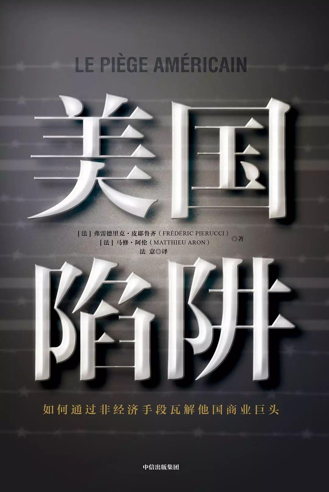

# 美国陷阱

读完之后，第一感觉就是对作者的遭遇深感不幸。落入大国的博弈，甚至不能说是博弈，而已单方面的蹂躏。被当做一个样本，仿佛就是在说，你们看，不听话的下场就是这样，乖乖配合就可以从轻发落。从公司高管，沦落到阶下囚，人生的大起大落。

想起小学课本的一句话，以地事秦，犹抱薪救火，薪不尽，火不灭。米国的目的，大家也是心知肚明，维持现有的霸权地位，要从方方面面来称霸，任何能对米国产生阻碍的国家或者企业，都是肉中钉，眼中刺。一部《反海外腐败法》，真的是闹剧一场，自己给自己定个基调，说是从米国法律从面，找出腐败加以惩处。在这个法制的社会，给自己找了一个最合适的理由，违法的行为总是需要以法律的行为进行惩处。但是这属于干涉别国公司的内部运作的形式。我在A国贪腐了，还用得着你狗拿耗子。只不过通过这种方法，米国的企业就更加有谈判的筹码。

基本上违发这部闹剧法律的公司，都是和米国的企业有竞争关系的企业。目前还没有那个新技术企业，和米国的企业没有竞争关系，毕竟就现在来说，新科技公司的技术，大部分技术还是绕不开米国的。猜测一下，东方巨龙有一天，开发了新兴技术，比如新兴航空技术，而米国从未涉猎的方面，米国还是会通过这部法律，因为没有竞对的原因，所以要不就抓一个重点，享牢狱之灾，要不就直接让米国企业来收购。一犹如文中阿尔斯通。

祖国之光，不是阿里，不是腾讯，而是做实事的华为。华为的技术，在一些方面，是世界领先的，比如5G。面对如此危险，米国能坐视不理，任由他超过米国的科技吗？新科技在军事经济的目的，战略目的很重要，5G的发展，无论在那个方面，都显得那么重要。孟晚舟事件，就是化身饕餮的米国的一场令人发指的事件。能以莫须有的罪名，来抓住重要任务来迫使华为承认他们的犯罪事实。无罪，何以认。同时对华为的打压，各方面的压力，已经看出华为对米国的威胁，力度之大，范围之广，令米国左立不安。

愿华为，竖祖国之脊梁，荣名族之荣光。
