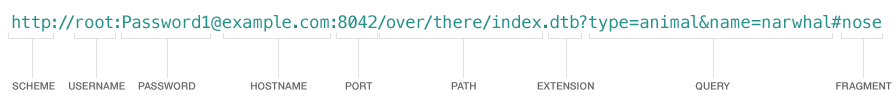

# NSURL / NSURLComponents

一个完整`URL`如下：



当然，大部分的情况下，可能使用简单的结构：

``` 
// 地址 
https://www.baidu.com/api?page=1
// 结构
scheme://host/path?query
```


## NSURL

方法：

``` js
+ (nullable instancetype)URLWithString:(NSString *)URLString relativeToURL:(nullable NSURL *)baseURL;
```

先说结论：

1. baseurl要以"/"结尾，如`https://www.baidu.com/api/`
2. relativeUrl不能以"/"开始, 如`api/teset`
3. relativeUrl是个完整url的情况下，baseurl无效

测试代码如下：
``` js
NSURL *baseURL1 = [NSURL URLWithString:@"http://example.com/v1/v2/"];
NSURL *baseURL2 = [NSURL URLWithString:@"http://example.com/v1/v2"];

NSURL *url11 = [NSURL URLWithString:@"foo" relativeToURL:baseURL1];
NSURL *url12 = [NSURL URLWithString:@"foo" relativeToURL:baseURL2];
// http://example.com/v1/v2/foo
// http://example.com/v1/foo

NSURL *url21 = [NSURL URLWithString:@"foo?bar=baz" relativeToURL:baseURL1];
NSURL *url22 = [NSURL URLWithString:@"foo?bar=baz" relativeToURL:baseURL2];
// http://example.com/v1/v2/foo?bar=baz
// http://example.com/v1/foo?bar=baz

NSURL *url31 = [NSURL URLWithString:@"/foo" relativeToURL:baseURL1];
NSURL *url32 = [NSURL URLWithString:@"/foo" relativeToURL:baseURL2];
//  http://example.com/foo
// http://example.com/foo

NSURL *url41 = [NSURL URLWithString:@"foo/" relativeToURL:baseURL1];
NSURL *url42 = [NSURL URLWithString:@"foo/" relativeToURL:baseURL2];
// http://example.com/v1/v2/foo/
// http://example.com/v1/foo/

NSURL *url51 = [NSURL URLWithString:@"/foo/" relativeToURL:baseURL1];
NSURL *url52 = [NSURL URLWithString:@"/foo/" relativeToURL:baseURL2];
// http://example.com/foo/
// http://example.com/foo/

NSURL *url61 = [NSURL URLWithString:@"http://example2.com/" relativeToURL:baseURL1];
NSURL *url62 = [NSURL URLWithString:@"http://example2.com/" relativeToURL:baseURL2];
// http://example2.com/
// http://example2.com/

NSLog(@"%@||||||%@", url11.absoluteURL, url12.absoluteURL);
NSLog(@"%@||||||%@", url21.absoluteURL, url22.absoluteURL);
NSLog(@"%@||||||%@", url31.absoluteURL, url32.absoluteURL);
NSLog(@"%@||||||%@", url41.absoluteURL, url42.absoluteURL);
NSLog(@"%@||||||%@", url51.absoluteURL, url52.absoluteURL);
NSLog(@"%@||||||%@", url61.absoluteURL, url62.absoluteURL);
```

## NSURLComponents

可以通过url或者string的方式，来生成urlComponents.


方法：

``` js
+ (nullable instancetype)componentsWithURL:(NSURL *)url resolvingAgainstBaseURL:(BOOL)resolve;
```

resolvingAgainstBaseURL参数是说通过url的方式来生成urlComponents的时候，如果
resolvingAgainstBaseURL参数，是说如果一个url，是通过relative 另一个 NSURL来创建的，会有所区别，会缺少baseUrl的部分。

如下：

```
NSString *urlStr = @"https://www.baidu.com/api/";
NSURL *base = [NSURL URLWithString:urlStr];
NSURL *url = [NSURL URLWithString:@"test?search=image" relativeToURL:base];

NSURLComponents *components = [NSURLComponents componentsWithURL:url resolvingAgainstBaseURL:YES];
NSURLComponents *components2 = [NSURLComponents componentsWithURL:url resolvingAgainstBaseURL:NO];

NSLog(@"%@", components.string);
NSLog(@"%@", components2.string);

// 输出
https://www.baidu.com/api/test?search=image
test?search=image
```
