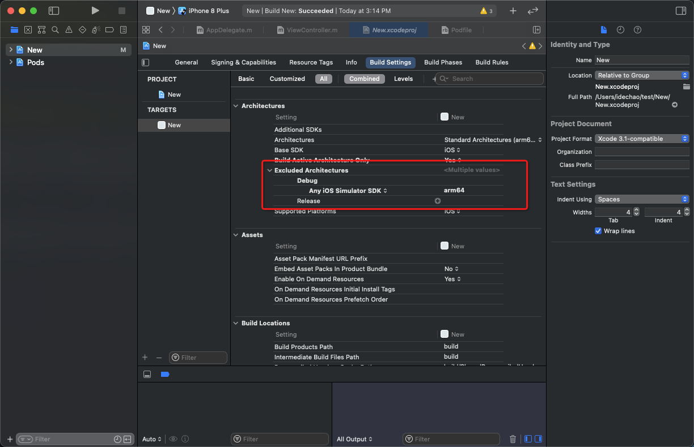

# Lookin

和`Reveal`相同的工具，用于iOS的UI调试。

重点是工具免费，而且，好看，又好用~

官网地址：
https://lookin.work/

集成方式也有详细介绍；
https://lookin.work/faq/integration-guide/

## 问题：断点已经设置却没有相应的程序

需要增加`arm64`的架构

增加这个架构之后，如果是pod依赖的，那有可能项目会运行报错，需要把pod下其他项目也设置对应的arm64架构.

> 注意：
> 使用断点来使用的情况下，只能应用于模拟器。如果想真机，可以使用podfile的方式来集成，可以添加的debug模式下