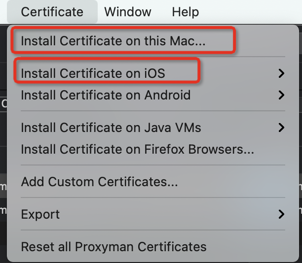
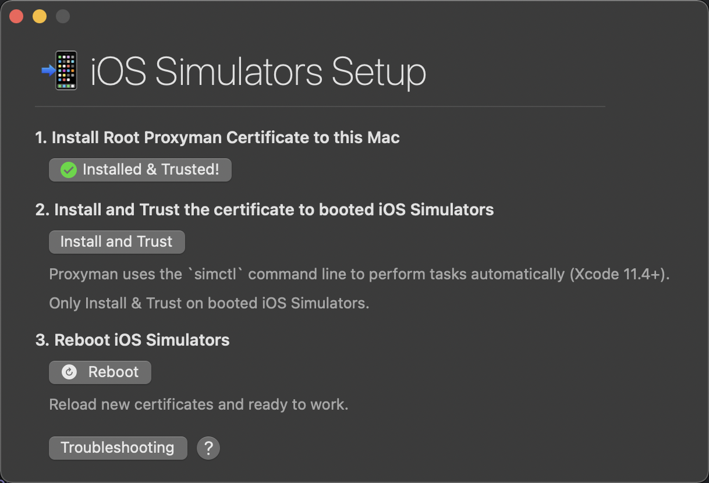
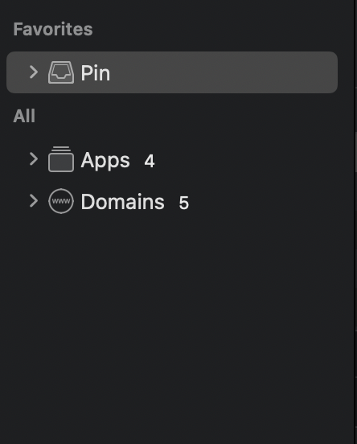
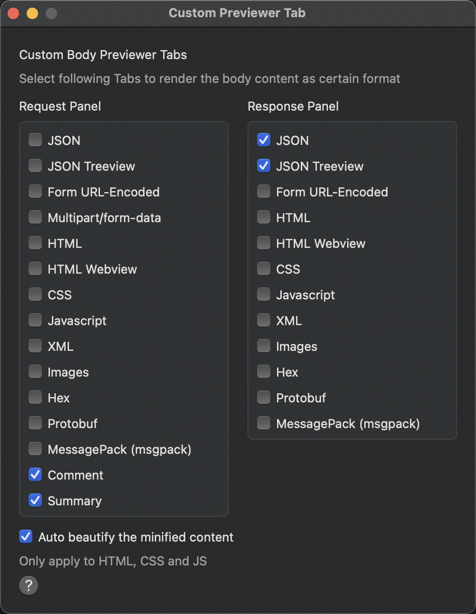

# 抓包神奇Proxyman

## 介绍

- 官网链接：[Proxyman](https://proxyman.io/)
- 当然了，优秀的软件总是有开源的地址：[github](https://github.com/ProxymanApp/Proxyman)

一个和Charles比肩的抓包神器，从个人的体验上来说，Proxyman让我更加喜欢一点。

可以抓包https，更加加单的授权过程，以及更好的界面管理。

## 授权配置

授权过程，这里和Charles是类似的。现授权mac根证书，然后安装模拟器证书，同时在模拟器中信任一下。

不过这里就显得很友好。

## 页面展示

这里会有app维度和域名维度

返回数据格式，可以选择是json或者树状

## 其他功能

如网络环境设置，https，map local基本和charles类似。

