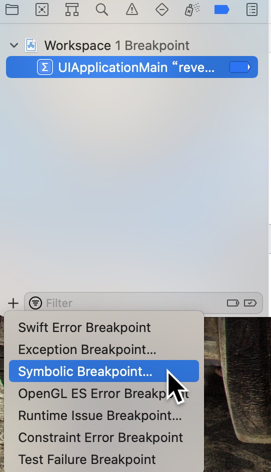

# 使用reveal分析app结构

此方法仅适用于在iOS模拟器上运行的应用

通过不修改Xcode工程文件来加载Reveal的方式，您可以检视任何一个您正在开发的iOS应用，而不需要对这些应用的工程做任何修改。另一个好处就是，您不需要再担心，犯下一不小心将Reveal库连接到应用中发布了的错误。

## reveal

使用的版本是24

在应用程序中，找到revela.app，右键，显示包内容，一直进入到`SharedSupport`目录下。
```
/Applications/Reveal.app/Contents/SharedSupport
```

当前目录下，有个`RevealServer.zip`，双击解压，之后进入子目录：iOS->RevealServer.framework，里面的`RevealServer`就是我们需要使用的。完整目录如下：

```
/Applications/Reveal.app/Contents/SharedSupport/RevealServer/iOS//RevealServer.framework/RevealServer
```

## xcode配置



1、 打开iOS工程，选择 View → Navigators → `Show the Breakpoint Navigator`。

2、 在面板左下角，点击 + 按钮并选择 `Symbolic Breakpoint`。

3、 在 Symbol 输入区内输入 `UIApplicationMain` 。

4、 点击 Add Action 按钮, 确认 Action 被设置为 `Debugger Command`。

5、 将以下内容拷贝到 Action 的输入区内:

```
expr (Class)NSClassFromString(@"IBARevealLoader") == nil ? (void *)dlopen("/Applications/Reveal.app/Contents/SharedSupport/RevealServer/iOS//RevealServer.framework/RevealServer", 0x2) : ((void*)0)
```

<div style="color:red;font-weight:bold;">注意: 请确认Reveal.app的路径信息符合您Mac的实际位置。</div>

6、 选中 Automatically continue after evaluating actions 选项。 Reveal

7、 右击刚才新创建的断点，选择 Move Breakpoint To → User. 可以像其他断点一样，禁用或启用此断点。用户级别断点在所有的Xcode工程中都可以使用。

8、 在iOS模拟器上构建并运行您的应用。如果一切正常运行，请切换到Reveal应用，此时您的应用应会出现在应用选择器的下拉列表当中。

9、 选中您的应用，确认可以看到此时正在模拟器中运行的应用界面截图。

