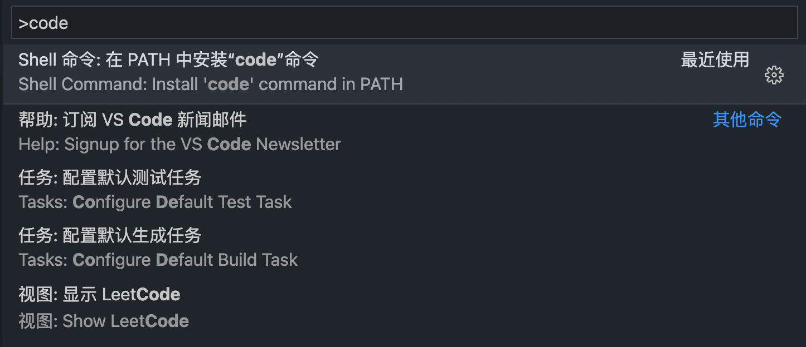

# 新mac电脑设置

## 环境设置

1. 安装[nvm](https://njafei.github.io/2018/03/23/nvm-install/)，或者[nvs](https://chair.antfin-inc.com/advanced/nodejs/nvs.html)
2. 安装node
2. brew
3. iterm(brew install iterm2 --cask) + zsh
4. git配置
5. ts，ts-node


### cocospods安装

1. 安装rvm

```
curl -L get.rvm.io | bash -s stable 

source ~/.bashrc

source ~/.bash_profile

source ~/.zshrc
```

2. 更新ruby源

```
gem sources --remove https://rubygems.org
gem sources -a https://gems.ruby-china.com

gem sources -l
```

3. 安装pods

```
sudo gem install cocoapods // 会安装到/sr/local/bin/pod下，可用 which pod命令查看
pod setup // 更新本地pod索引
```

执行 `pod setup` 直接提示 `Setup completed`，然而啥也没有做，索引库也没有建立。

查看repo，`pod repo list`，发现啥都没有，手动添加一下repo,

```
pod repo add github https://github.com/CocoaPods/Specs.git master
```
## 操作设置

1. 输入法切换，修改command+空格: 点击输入法，进入键盘偏好设置，点击快捷键，选择左侧的输入法，输入command+空格，有冲突的直接去掉好了
2. [启用三指拖拽](https://support.apple.com/zh-cn/HT204609)
3. [字体大小调节](https://zhuanlan.zhihu.com/p/82412245)
4. [电池显示百分比](https://www.jianshu.com/p/904e1e9710bd)
5. [mac暖色调设置](https://jingyan.baidu.com/article/60ccbceb50823c64cab1978a.html)
6. 命令行下，按方向键快速移动光标，可以在系统偏好直接搜索按键重复，调整按键重复为快
7. 放大功能，辅助功能下，勾选配合修饰健使用滚动收拾来缩放，样式选择画中画


## 应用软件

- [MAC允许任何来源应用运行](https://www.jianshu.com/p/72ed5d2954e8)

- chrome
- Alfred
- 搜狗输入法（主要喜欢一个皮肤，帅气の草泥马先生）
- vscode
- One Switch 或者 Caffeinated - 防休眠软件
- CleanMyMac X - 电脑清理软件
- Wallpaper Wizard - 动态壁纸软件，主要图片很喜欢
- 1password - 密码管理
- Fantastical - 日历
- MacDown - markdown编辑器
- Bartender or Dozer - mac状态栏管理
- mindnode - 思维导图
- HyperDock - mac系统软件
- Boom 3D - 音效
- JustFocus - 专注软件
- Things - 待办事项

## 开发软件

- xcode
- xscope - 测量软件
- [Go2Shell](https://github.com/Breathleas/Go2Shell)
- charles & proxyman - 抓包
- safari technology preview - 网页调试
- sourcetree - git管理
- ihost - host工具
- reveal - ios层级分析利器
- sketch - 视觉分析软件
- WebStorm - web/js开发

## git相关

name、email配置，ssh key配置

### 公钥

```
// 生成
ssh-keygen -t rsa -C "your_email@example.com"

// 复制
pbcopy < ~/.ssh/id_rsa.pub

```

### 快捷键配置

参考：[链接](https://blog.csdn.net/u013294097/article/details/88832749)

## zsh安装

可参考[链接](https://blog.csdn.net/taurus_7c/article/details/115931601)，

设置[默认终端](https://blog.csdn.net/wujunlei1595848/article/details/82218194)

[隐藏命令行前面的用户名和主机名](https://blog.csdn.net/zmzwll1314/article/details/118410663)

## VSCode安装code指令

安装命令之后，可以直接使用 `code PATH` 的方式打开目录。如 `code .`

方法：command+shift+p，然后输入code




## Fantastical添加苹果账户

起码得添加个账户，否则无法添加事件。添加google日历也可以。

进入到苹果账户管理页面，[https://appleid.apple.com/account/manage](https://appleid.apple.com/account/manage)，在安全模块下有App专用密码，点击生成，使用该密码登录。


